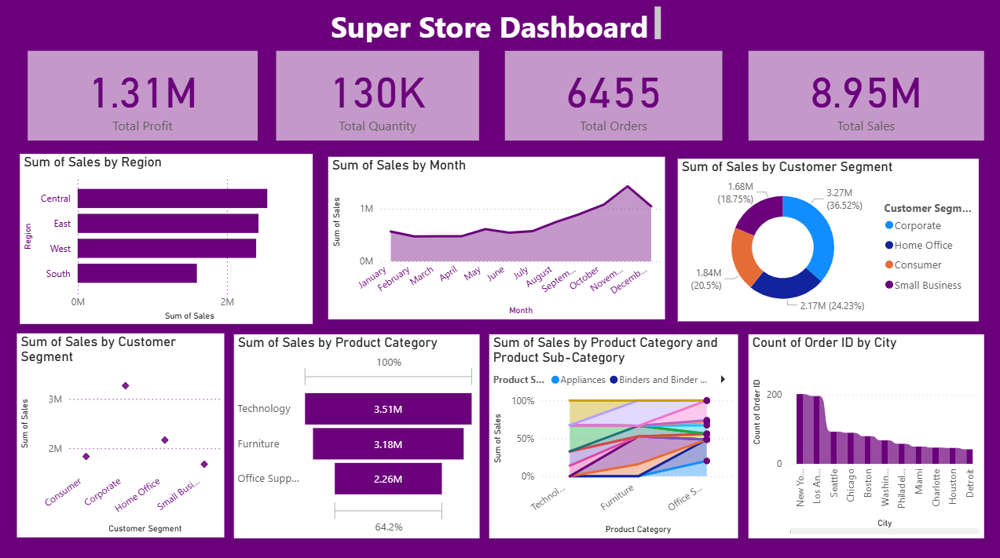

# 📊 Super Store Sales Dashboard – Power BI

This project presents an interactive **Super Store Sales Dashboard** built using **Microsoft Power BI** to analyze sales performance, customer segments, regions, and product categories using a retail dataset.

---

## 🔍 Project Overview

The dashboard provides key business insights such as:
- Total Sales, Profit, Quantity, and Orders
- Sales trends over time
- Regional and city-wise performance
- Customer segment contribution
- Product category and sub-category analysis

This project demonstrates my ability to transform raw data into meaningful business insights using data visualization techniques.

---

## 📌 Key KPIs

- **Total Sales:** 8.95M  
- **Total Profit:** 1.31M  
- **Total Quantity Sold:** 130K  
- **Total Orders:** 6,455  

---

## 📊 Dashboard Insights

### 🗺️ Sales by Region
- The central region contributes the highest sales
- The South region shows relatively lower performance

### 📅 Sales Trend by Month
- Peak sales observed during **October–November**
- Seasonal growth towards the year-end

### 👥 Customer Segment Analysis
- **Corporate** segment contributes the highest sales
- Followed by **Home Office** and **Consumer**

### 🛒 Product Category Performance
- **Technology** leads in sales
- **Furniture** and **Office Supplies** follow

### 🏙️ City-wise Orders
- New York and Los Angeles have the highest order volumes

---

## 🧰 Tools & Technologies Used

- **Power BI**
- **Microsoft Excel**
- **Data Cleaning & Transformation**
- **Data Visualization**
- **Business Analytics**

---

## 📂 Files in This Repository

- `Super_Store_Sales_Dashboard.pbix` – Interactive Power BI dashboard  
- `Superstore_Dataset.xlsx` – Source dataset used for analysis  
- `Dashboard_Screenshot.png` – Dashboard preview image  

---

## 🎯 Skills Demonstrated

- Data Analysis  
- Business Intelligence  
- Dashboard Design  
- KPI Tracking  
- Insight Generation  
- Storytelling with Data  

---

## 📸 Dashboard Preview

---

## 📬 Contact

**Kathir Ranjanaa S**  
📧 Email: kathirranjanaas@gmail.com  
🔗 LinkedIn: https://www.linkedin.com/in/kathir-ranjanaa-s/  
💻 GitHub: https://github.com/Kathirranjanaa  

---

⭐ If you like this project, feel free to star the repository!

